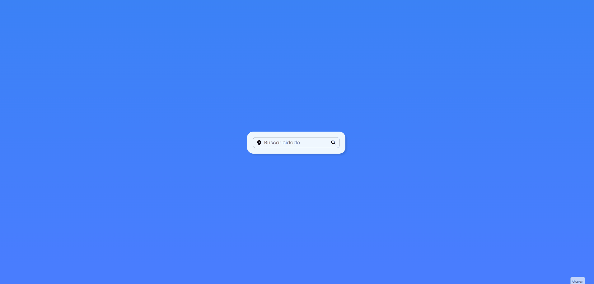

## 🌦️ Weather Forecast

É um Website desenvolvido para consultar a **previsão do tempo em tempo real** de qualquer cidade, utilizando a **API OpenWeatherMap**.
O projeto foi criado com foco em aprimorar habilidades em **JavaScript**, **consumo de APIs** e **manipulação dinâmica do DOM**.

## 🌍 Demo

🔗 Clique aqui para uma breve demonstração do Website.

## 🧭 Introdução

Este projeto tem como objetivo oferecer uma forma simples e intuitiva de consultar informações meteorológicas, como temperatura, umidade, velocidade do vento e condições climáticas atuais.

Ao digitar o nome de uma cidade, o sistema faz uma requisição à API OpenWeatherMap, retornando os dados atualizados e exibindo-os de maneira visual e organizada.

Além disso, a aplicação trata erros de busca (como cidades inexistentes) exibindo mensagens amigáveis e utiliza ícones dinâmicos para representar o clima atual.

## 💻 Tecnologias Utilizadas

HTML

CSS

JavaScript

OpenWeatherMap API

## ⚙️ Principais Características

Busca de cidades com retorno imediato via API

Exibição de informações climáticas completas (temperatura, umidade, vento, descrição)

Ícones dinâmicos conforme a condição do tempo

Mensagens personalizadas de erro ou alerta

Design responsivo e moderno

Estrutura simples e organizada em pastas

## 🤝 Contribuição e Modificação do Projeto

Se encontrar algum problema ou tiver sugestões de melhorias, sinta-se à vontade para abrir um issue ou pull request.
Toda contribuição é bem-vinda!
